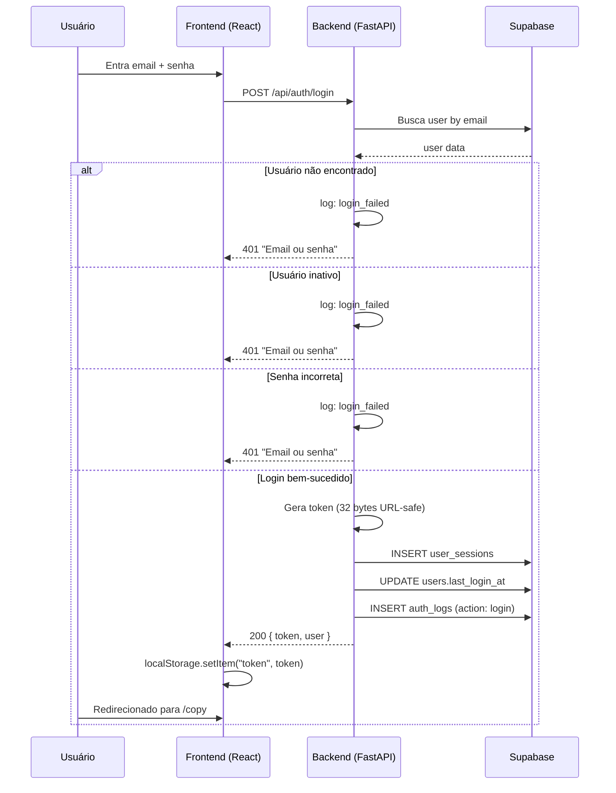
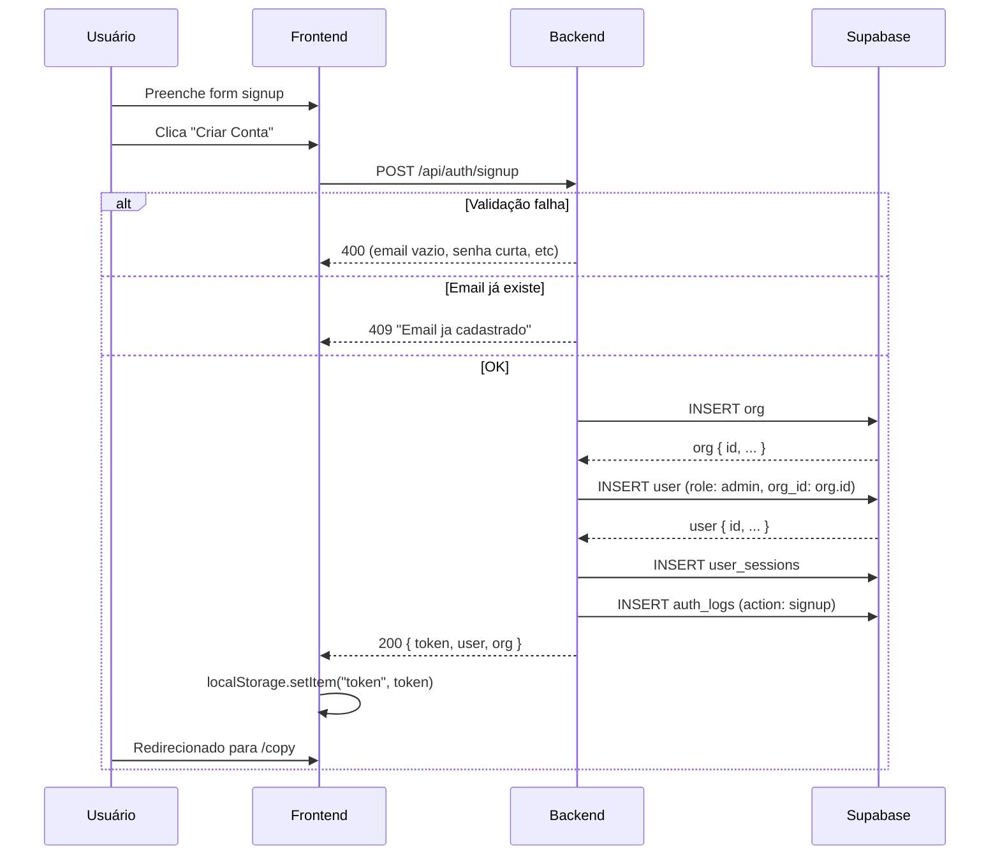
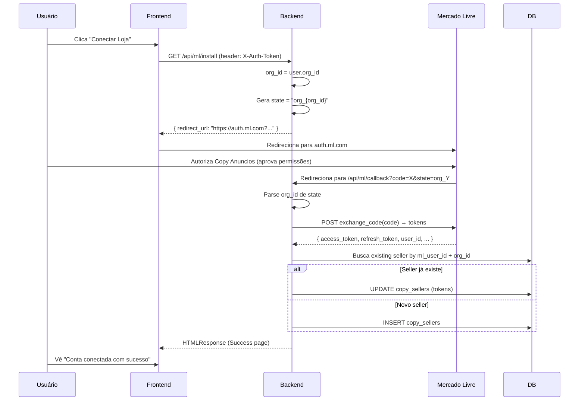
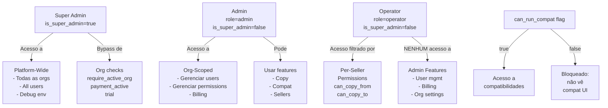
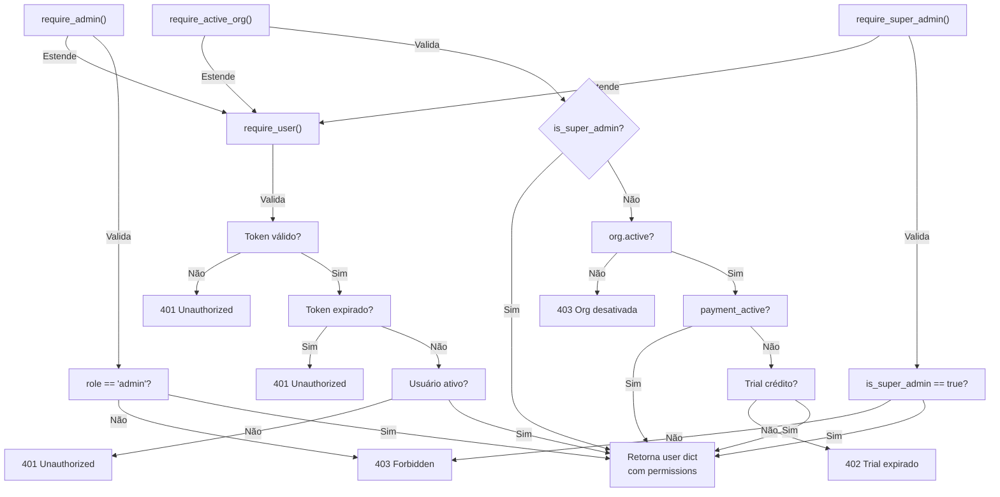

# Autenticação, Autorização e Segurança

Documentação minuciosa dos mecanismos de segurança, fluxos de autenticação e controles de acesso (RBAC) da plataforma Copy Anuncios.

---

## Sumário

1. [Modelo de Autenticação](#modelo-de-autenticação)
2. [RBAC — Role-Based Access Control](#rbac--role-based-access-control)
3. [Multi-tenancy e Isolamento](#multi-tenancy-e-isolamento)
4. [OAuth2 Mercado Livre](#oauth2-mercado-livre)
5. [Segurança Stripe Webhook](#segurança-stripe-webhook)
6. [Password Reset e Recuperação](#password-reset-e-recuperação)
7. [Proteções de Segurança](#proteções-de-segurança)
8. [Diagramas de Fluxo](#diagramas-de-fluxo)
9. [Logs de Auditoria](#logs-de-auditoria)
10. [Troubleshooting e Verificações](#troubleshooting-e-verificações)

---

## Modelo de Autenticação

### Visão Geral

A plataforma utiliza um sistema de **session tokens** (tokens de sessão) gerados após login bem-sucedido ou signup. Os tokens são:

- **32 bytes URL-safe** (gerados via `secrets.token_urlsafe(32)`)
- **TTL de 7 dias** (expiração definida em `SESSION_EXPIRY_DAYS = 7`)
- **Armazenados na tabela `user_sessions`** do Supabase
- **Transmitidos via header `X-Auth-Token`** em toda requisição autenticada

### Fluxo Completo: Signup → Login → Requisições → Logout

#### 1. Signup (Self-Service Onboarding)

**Endpoint:** `POST /api/auth/signup`

**Request:**
```json
{
  "email": "admin@empresa.com.br",
  "password": "senha_segura_123",
  "company_name": "Minha Empresa LTDA"
}
```

**Validações:**
- Email obrigatório e não vazio
- Senha mínimo 6 caracteres
- Nome da empresa obrigatório e não vazio
- Email verificado para evitar duplicatas

**Operações:**

1. **Criação de Org (Organização):**
   ```sql
   INSERT INTO orgs (name, email, active, payment_active)
   VALUES ('Minha Empresa LTDA', 'admin@empresa.com.br', true, false)
   ```
   - Criada com `active = true` (imediatamente ativa)
   - `payment_active = false` (entra em período de teste)
   - Recebe trial de 20 cópias (default em `trial_copies_limit`)

2. **Criação de Usuário Admin:**
   ```sql
   INSERT INTO users (email, username, password_hash, role, org_id, can_run_compat, active)
   VALUES ('admin@empresa.com.br', 'admin@empresa.com.br', '<bcrypt_hash>', 'admin', '<org_id>', true, true)
   ```
   - Role automaticamente `admin`
   - `can_run_compat` = true (acesso a compatibilidades)
   - `active = true`

3. **Criação de Session Token:**
   ```sql
   INSERT INTO user_sessions (user_id, token, expires_at)
   VALUES ('<user_id>', '<32_byte_token>', '<now + 7 days>')
   ```

4. **Log de Auditoria:**
   ```sql
   INSERT INTO auth_logs (user_id, username, org_id, action)
   VALUES ('<user_id>', 'admin@empresa.com.br', '<org_id>', 'signup')
   ```

**Response:**
```json
{
  "token": "XyZ...AbC==",
  "user": {
    "id": "550e8400-e29b-41d4-a716-446655440000",
    "username": "admin@empresa.com.br",
    "email": "admin@empresa.com.br",
    "role": "admin",
    "can_run_compat": true
  },
  "org": {
    "id": "660e8400-e29b-41d4-a716-446655440001",
    "name": "Minha Empresa LTDA"
  }
}
```

#### 2. Login (Autenticação com Email/Password)

**Endpoint:** `POST /api/auth/login`

**Request:**
```json
{
  "email": "admin@empresa.com.br",
  "password": "senha_segura_123"
}
```

**Fluxo:**

1. **Busca de Usuário:**
   ```python
   user = db.table("users").select("*").eq("email", req.email).execute()
   ```
   - Se usuário não encontrado: lança 401 + log `login_failed`

2. **Verificação de Status:**
   ```python
   if not user.get("active"):
       raise HTTPException(status_code=401, detail="Email ou senha incorretos")
   ```
   - Se inativo: lança 401 + log `login_failed` (mesmo erro para não revelar estado)

3. **Verificação de Password:**
   ```python
   if not bcrypt.checkpw(req.password.encode(), user["password_hash"].encode()):
       raise HTTPException(status_code=401, detail="Email ou senha incorretos")
   ```
   - Se senha incorreta: lança 401 + log `login_failed`

4. **Geração de Token:**
   ```python
   token = secrets.token_urlsafe(32)
   expires_at = datetime.now(timezone.utc) + timedelta(days=7)
   db.table("user_sessions").insert({
       "user_id": user["id"],
       "token": token,
       "expires_at": expires_at.isoformat()
   }).execute()
   ```

5. **Atualização de Last Login:**
   ```python
   db.table("users").update({
       "last_login_at": datetime.now(timezone.utc).isoformat()
   }).eq("id", user["id"]).execute()
   ```

6. **Log de Auditoria:**
   ```sql
   INSERT INTO auth_logs (user_id, username, action)
   VALUES ('<user_id>', '<username>', 'login')
   ```

**Response:**
```json
{
  "token": "XyZ...AbC==",
  "user": {
    "id": "550e8400-e29b-41d4-a716-446655440000",
    "username": "admin@empresa.com.br",
    "role": "admin",
    "can_run_compat": true
  }
}
```

#### 3. Requisições Autenticadas

**Todas as requisições protegidas exigem:**
```
Header: X-Auth-Token: <token>
```

**Exemplo:**
```bash
curl -H "X-Auth-Token: XyZ...AbC==" https://api.copy.com.br/api/auth/me
```

**Validação no Backend (Dependency `require_user`):**

```python
async def require_user(x_auth_token: str = Header(...)) -> dict:
    # 1. Busca sessão
    session = db.table("user_sessions").select("*").eq("token", x_auth_token).execute()
    if not session.data:
        raise HTTPException(status_code=401, detail="Token inválido ou expirado")

    # 2. Verifica expiração
    if datetime.now(timezone.utc) > session["expires_at"]:
        db.table("user_sessions").delete().eq("id", session["id"]).execute()
        raise HTTPException(status_code=401, detail="Token inválido ou expirado")

    # 3. Busca usuário
    user = db.table("users").select("*").eq("id", session["user_id"]).execute()
    if not user.data or not user["active"]:
        raise HTTPException(status_code=401, detail="Token inválido ou expirado")

    # 4. Carrega permissões por vendedor
    permissions = db.table("user_permissions").select(
        "seller_slug, can_copy_from, can_copy_to"
    ).eq("user_id", user["id"]).execute()

    # 5. Retorna user dict com contexto completo
    return {
        "id": user["id"],
        "username": user["username"],
        "email": user["email"],
        "role": user["role"],
        "org_id": user["org_id"],
        "is_super_admin": user.get("is_super_admin", False),
        "can_run_compat": user["can_run_compat"],
        "permissions": permissions.data
    }
```

**Comportamentos Importantes:**

- **Sessão expirada:** Token removido do banco automaticamente
- **Usuário desativado:** Mesmo com token válido, acesso negado
- **Token inválido:** Sempre retorna 401 (não diferencia entre expirado e falso)

#### 4. Logout (Invalidação de Token)

**Endpoint:** `POST /api/auth/logout`

**Headers:**
```
X-Auth-Token: <token> (opcional, pode ser omitido)
```

**Fluxo:**

1. Se token fornecido:
   - Localiza sessão correspondente
   - Registra log de auditoria `logout`
   - Deleta registro da sessão

2. Sempre retorna 200 (mesmo se token não existir)

**Response:**
```json
{
  "status": "ok"
}
```

**SQL:**
```sql
DELETE FROM user_sessions WHERE token = '<token>'
```

---

## RBAC — Role-Based Access Control

### Hierarquia de Roles

A plataforma implementa um sistema de **3 roles principais + flags adicionais**:

```
┌─────────────────────────────────────────────────────────┐
│                    SUPER_ADMIN                          │
│  - is_super_admin = true                                │
│  - Acesso platform-wide                                 │
│  - Gerencia todas as orgs                               │
│  - Bypass de verificações de org                        │
└─────────────────────────────────────────────────────────┘
                           ▲
                           │ (não há escalação direta)
                           │
┌─────────────────────────────────────────────────────────┐
│                      ADMIN                              │
│  - role = "admin"                                       │
│  - is_super_admin = false                               │
│  - Acesso full-access dentro da própria org            │
│  - Gerencia usuários, permissões, billing              │
│  - Pode acessar todas as features (cópia, compatib.)   │
└─────────────────────────────────────────────────────────┘
                           ▲
                           │ (promoção via master password)
                           │
┌─────────────────────────────────────────────────────────┐
│                    OPERATOR                             │
│  - role = "operator"                                    │
│  - is_super_admin = false                               │
│  - Acesso filtrado por per-seller permissions          │
│  - SEM acesso a gerenciamento de usuários              │
│  - SEM acesso a billing                                │
│  - Acesso a cópias e compatibilidades se permitido    │
└─────────────────────────────────────────────────────────┘
```

### Flags Adicionais

| Flag | Tipo | Descrição |
|------|------|-----------|
| `is_super_admin` | Boolean | Acesso platform-wide (usuários especiais) |
| `can_run_compat` | Boolean | Permissão para usar compatibilidades veiculares |
| `can_copy_from` | Per-Seller | Permissão para copiar PARTIR deste vendedor |
| `can_copy_to` | Per-Seller | Permissão para copiar PARA este vendedor |
| `active` | Boolean | Usuário ativo ou desativado (soft-delete) |

### Controle de Acesso via Dependencies

O FastAPI utiliza **dependencies** para aplicar RBAC:

#### `require_user()` — Autenticação Básica

```python
async def require_user(x_auth_token: str = Header(...)) -> dict:
    """Valida token e retorna user dict com permissões."""
```

**Exemplo de uso:**
```python
@router.get("/api/copy/logs")
async def copy_logs(user: dict = Depends(require_user)):
    # Qualquer usuário autenticado pode acessar
    return copy_logs_for_org(user["org_id"])
```

**Aplicado em:**
- `/api/auth/me` — Get current user
- `/api/copy/logs` — Copy history
- `/api/compat/logs` — Compat history
- `/api/sellers` — List sellers
- `/api/billing/create-checkout` — Criar sessão Stripe
- `/api/billing/status` — Status de billing

#### `require_admin()` — Admin dentro da Org

```python
async def require_admin(x_auth_token: str = Header(...)) -> dict:
    """Estende require_user, verifica role == 'admin'."""
    user = await require_user(x_auth_token)
    if user["role"] != "admin":
        raise HTTPException(status_code=403, detail="Acesso restrito a administradores")
    return user
```

**Exemplo de uso:**
```python
@router.post("/api/admin/users")
async def create_user(req: CreateUserRequest, user: dict = Depends(require_admin)):
    # Apenas admins podem criar usuários
    db.table("users").insert({...}).execute()
```

**Aplicado em:**
- `/api/admin/users` — CRUD de usuários
- `/api/admin/users/{id}/permissions` — Atualizar permissões
- `/api/billing/create-checkout` — Admin pode abrir checkout
- `/api/billing/create-portal` — Admin pode acessar portal

#### `require_super_admin()` — Platform-Wide

```python
async def require_super_admin(x_auth_token: str = Header(...)) -> dict:
    """Estende require_user, verifica is_super_admin == true."""
    user = await require_user(x_auth_token)
    if not user.get("is_super_admin"):
        raise HTTPException(status_code=403, detail="Acesso restrito ao super-admin")
    return user
```

**Exemplo de uso:**
```python
@router.get("/api/super/orgs")
async def list_orgs(user: dict = Depends(require_super_admin)):
    # Apenas super-admins veem todas as orgs
    return db.table("orgs").select("*").execute()
```

**Aplicado em:**
- `/api/super/orgs` — List todas as orgs com stats
- `/api/super/orgs/{org_id}` — Ativar/desativar orgs
- `/api/debug/env` — Verificar env vars (super-admin only)

#### `require_active_org()` — Org Ativa + Billing/Trial

```python
async def require_active_org(x_auth_token: str = Header(...)) -> dict:
    """Estende require_user, verifica org ativa e crédito disponível."""
    user = await require_user(x_auth_token)

    # Super-admins bypass verificação
    if user.get("is_super_admin"):
        return user

    # Verifica org ativa
    org = db.table("orgs").select("active, payment_active, trial_copies_used, trial_copies_limit").execute()
    if not org["active"]:
        raise HTTPException(status_code=403, detail="Organizacao desativada")

    # Verifica pagamento ou trial
    if not org["payment_active"]:
        used = org.get("trial_copies_used", 0)
        limit = org.get("trial_copies_limit", 20)
        if used >= limit:
            raise HTTPException(status_code=402, detail="Periodo de teste encerrado")

    return user
```

**Cenários:**

| Cenário | `active` | `payment_active` | `trial_copies_used` | Resultado |
|---------|----------|------------------|-------------------|-----------|
| Org ativa, com pagamento | true | true | - | ✅ Acesso concedido |
| Org ativa, trial (crédito) | true | false | 5/20 | ✅ Acesso concedido |
| Org ativa, trial (expirado) | true | false | 20/20 | ❌ 402 Payment Required |
| Org desativada | false | - | - | ❌ 403 Forbidden |
| Super-admin | - | - | - | ✅ Acesso (bypass) |

**Aplicado em:**
- `/api/ml/install` — OAuth redirect
- `/api/ml/callback` — OAuth callback
- `/api/sellers` — List/rename/delete sellers
- `/api/copy` — Endpoints de cópia
- `/api/compat/copy` — Endpoints de compatibilidade

### Permissões Por Vendedor

Cada usuário operador tem permissões **granulares por vendedor** armazenadas em `user_permissions`:

```sql
CREATE TABLE user_permissions (
    user_id UUID NOT NULL,
    seller_slug VARCHAR(255) NOT NULL,
    can_copy_from BOOLEAN DEFAULT FALSE,
    can_copy_to BOOLEAN DEFAULT FALSE,
    org_id UUID NOT NULL,
    PRIMARY KEY (user_id, seller_slug)
);
```

**Exemplo:**

Usuário "operador_01" na org "Empresa A":

```sql
SELECT * FROM user_permissions WHERE user_id = 'operador_01_id';

| user_id | seller_slug | can_copy_from | can_copy_to |
|---------|-------------|---------------|-------------|
| ...     | loja-a      | true          | false       |
| ...     | loja-b      | true          | true        |
| ...     | loja-c      | false         | true        |
```

**Interpretação:**

- **loja-a:** Pode copiar PARTIR de loja-a, mas não PARA ela (só importação)
- **loja-b:** Pode copiar em ambas as direções (importar e exportar)
- **loja-c:** Só pode copiar PARA loja-c (receber itens)

**Como é Usado:**

Na requisição `POST /api/copy`, o backend:

1. Valida se o usuário tem `can_copy_from` para o vendedor de origem
2. Valida se o usuário tem `can_copy_to` para cada vendedor destino
3. Filtra dropdowns no frontend para mostrar apenas vendedores permitidos

**Endpoint de Gerenciamento:**

```bash
# Get permissões de um usuário
GET /api/admin/users/{user_id}/permissions
→ Retorna todos os vendedores conectados com permissões

# Update permissões
PUT /api/admin/users/{user_id}/permissions
{
  "permissions": [
    { "seller_slug": "loja-a", "can_copy_from": true, "can_copy_to": false },
    { "seller_slug": "loja-b", "can_copy_from": true, "can_copy_to": true }
  ]
}
```

---

## Multi-tenancy e Isolamento

### Modelo Multi-Tenant

Copy Anuncios é uma plataforma **SaaS multi-tenant** onde cada organização (empresa) é completamente isolada:

```
┌─────────────────────────────────────────────────────────┐
│                    PLATFORM                             │
├─────────────────────────────────────────────────────────┤
│                                                         │
│  ┌──────────────────┐    ┌──────────────────┐         │
│  │   ORG A (Empresa) │    │   ORG B (Empresa) │        │
│  ├──────────────────┤    ├──────────────────┤         │
│  │ Users:           │    │ Users:           │         │
│  │ - admin@a.com    │    │ - admin@b.com    │         │
│  │ - op1@a.com      │    │ - op1@b.com      │         │
│  │                  │    │                  │         │
│  │ Sellers:         │    │ Sellers:         │         │
│  │ - loja-a         │    │ - loja-x         │         │
│  │ - loja-b         │    │ - loja-y         │         │
│  │                  │    │                  │         │
│  │ Copy Logs:       │    │ Copy Logs:       │         │
│  │ - 150 ops        │    │ - 42 ops         │         │
│  └──────────────────┘    └──────────────────┘         │
│                                                         │
└─────────────────────────────────────────────────────────┘
```

### Isolamento via `org_id`

**Toda tabela crítica possui `org_id` FK→orgs:**

| Tabela | org_id | Propósito |
|--------|--------|-----------|
| `users` | ✅ | Usuários isolados por org |
| `copy_sellers` | ✅ | Vendedores conectados por org |
| `user_permissions` | ✅ | Permissões isoladas por org |
| `copy_logs` | ✅ | Histórico de cópias por org |
| `compat_logs` | ✅ | Histórico de compatibilidades por org |
| `auth_logs` | ✅ | Logs de auditoria por org |

### Dependency `require_active_org()`

Esta dependency garante:

1. **User belongs to org:** Verifica que o `user["org_id"]` é válido
2. **Org is active:** Verifica `orgs.active = true`
3. **Payment or trial:** Verifica pagamento ativo OU crédito de trial disponível
4. **Super-admin bypass:** Super-admins bypass todas as verificações

### Quando org_id é Usado

**Login/Signup:**
```python
# Signup cria org, atribui org_id ao novo user
db.table("users").insert({
    "org_id": org["id"],  # Isolamento estabelecido
    ...
}).execute()
```

**Queries de Operação:**
```python
# Todas as queries filtram por org_id do user logado
db.table("copy_logs").select("*").eq("org_id", user["org_id"]).execute()
# Garante que User A nunca vê logs de User B
```

**Permissões de Vendedor:**
```python
# Ao criar permissão, salva org_id para auditoria/isolamento
db.table("user_permissions").upsert({
    "user_id": user_id,
    "seller_slug": "loja-a",
    "can_copy_from": True,
    "org_id": user["org_id"],  # Isolamento por org
    ...
}).execute()
```

### Super-Admin Bypass

Super-admins possuem `is_super_admin = true` e podem:

- Visualizar todas as orgs
- Ativar/desativar orgs
- Ver históricos globais
- Acessar `/api/debug/env`

**Implementação:**
```python
async def require_active_org(x_auth_token: str = Header(...)) -> dict:
    user = await require_user(x_auth_token)

    # Super-admins bypass verificação
    if user.get("is_super_admin"):
        return user  # ← Não verifica org.active nem payment_active

    # Resto da verificação para usuários normais
    ...
```

---

## OAuth2 Mercado Livre

### Fluxo Completo de Autorização

Copy Anuncios integra com **Mercado Livre via OAuth2** para obter permissões de acesso às contas de vendedores.

```
┌──────────────────────────────────────────────────────────────────┐
│                     FLUXO OAUTH2 ML                              │
├──────────────────────────────────────────────────────────────────┤
│                                                                  │
│  1. User clica "Conectar Loja"                                  │
│                                                                  │
│  2. Frontend chama GET /api/ml/install                           │
│      ↓                                                            │
│     Backend retorna URL de redirecionamento para ML               │
│      ↓                                                            │
│  3. User é redirecionado para https://auth.mercadolivre.com.br  │
│      ↓                                                            │
│  4. User autoriza Copy Anuncios (nega/aprova permissões)        │
│      ↓                                                            │
│  5. ML redireciona de volta para /api/ml/callback                │
│      com authorization code e state                              │
│      ↓                                                            │
│  6. Backend troca code por access_token + refresh_token          │
│      ↓                                                            │
│  7. Backend salva tokens em copy_sellers table                   │
│      ↓                                                            │
│  8. Frontend exibe "Conta conectada com sucesso!"                │
│                                                                  │
└──────────────────────────────────────────────────────────────────┘
```

### Step 1-2: Iniciar OAuth (`GET /api/ml/install`)

**Endpoint:**
```bash
GET /api/ml/install
Header: X-Auth-Token: <token>
```

**Dependency:** `require_active_org()` — Garante que org está ativa

**Fluxo:**

```python
@router.get("/api/ml/install")
async def install(user: dict = Depends(require_active_org)):
    org_id = user["org_id"]
    params = urlencode({
        "response_type": "code",
        "client_id": settings.ml_app_id,      # App ID cadastrada em ML Dev Center
        "redirect_uri": settings.ml_redirect_uri,  # https://copy.com.br/api/ml/callback
        "state": f"org_{org_id}",             # Estado contém org_id para roteamento
    })
    redirect_url = f"https://auth.mercadolibre.com.br/authorization?{params}"
    return {"redirect_url": redirect_url}
```

**Response:**
```json
{
  "redirect_url": "https://auth.mercadolibre.com.br/authorization?response_type=code&client_id=..._app_id...&redirect_uri=https%3A%2F%2Fcopy.com.br%2Fapi%2Fml%2Fcallback&state=org_660e8400-e29b-41d4-a716-446655440001"
}
```

**State Parameter:**

O `state` contém `org_{org_id}` para:
- **CSRF Protection:** Valida que o callback veio do fluxo iniciado por esta org
- **Multi-tenant routing:** Identifica qual org receberá os tokens
- **Auditoria:** Registra qual org autorizou qual vendedor

### Step 3-5: ML Redireciona com Code

Mercado Livre redireciona browser para:

```
GET /api/ml/callback?code=TG-660e8400-...-asdf&state=org_660e8400-e29b-41d4-a716-446655440001
```

### Step 6: Trocar Code por Tokens (`GET /api/ml/callback`)

**Endpoint:**
```bash
GET /api/ml/callback?code=<code>&state=org_<org_id>
```

**Sem autenticação** (callback aberto, pois vem de ML)

**Fluxo:**

```python
@router.get("/api/ml/callback")
async def callback(code: str, state: str = ""):
    # 1. Parse org_id do state
    if not state.startswith("org_"):
        raise HTTPException(status_code=400, detail="Missing org_id in state")
    org_id = state[4:]

    # 2. Troca code por tokens (chamada assíncrona para ML API)
    token_data = await exchange_code(code)
    # Retorna: {
    #   "access_token": "...",
    #   "refresh_token": "...",
    #   "expires_in": 21600,     (6 horas em segundos)
    #   "user_id": 123456789,
    #   "scope": "..."
    # }

    # 3. Extrai tokens
    access_token = token_data.get("access_token")
    refresh_token = token_data.get("refresh_token")
    expires_in = token_data.get("expires_in", 21600)

    if not access_token:
        raise HTTPException(status_code=502, detail="ML OAuth returned no access_token")

    # 4. Calcula expiração
    expires_at = datetime.now(timezone.utc) + timedelta(seconds=expires_in)

    # 5. Busca info do seller (GET /users/me em ML API)
    user_info = await fetch_user_info(access_token)
    ml_user_id = user_info["id"]
    slug = user_info.get("nickname", f"seller_{ml_user_id}").lower().replace(" ", "-")

    # 6. Salva/atualiza em copy_sellers
    existing = db.table("copy_sellers").select("slug").eq("ml_user_id", ml_user_id).eq("org_id", org_id).execute()

    if existing.data:
        # Update tokens para seller existente
        db.table("copy_sellers").update({
            "ml_access_token": access_token,
            "ml_refresh_token": refresh_token or existing[0].get("ml_refresh_token"),
            "ml_token_expires_at": expires_at.isoformat(),
        }).eq("slug", existing[0]["slug"]).execute()
    else:
        # Insert novo seller
        db.table("copy_sellers").insert({
            "slug": slug,
            "ml_user_id": ml_user_id,
            "ml_access_token": access_token,
            "ml_refresh_token": refresh_token,
            "ml_token_expires_at": expires_at.isoformat(),
            "active": True,
            "org_id": org_id,
        }).execute()

    # 7. Retorna página HTML de sucesso
    return HTMLResponse(content=success_html)
```

**Tratamento de `refresh_token` Ausente:**

Às vezes, ML **não retorna `refresh_token`** (depende do scope autorizado):

```python
if not refresh_token:
    logger.warning(
        "ML OAuth returned no refresh_token. scope=%s user_id=%s",
        token_data.get("scope"),
        ml_user_id_from_token,
    )
    # Fallback: usa refresh_token anterior (se houver reauth)
    effective_refresh_token = existing_row.get("ml_refresh_token")
```

**Consequência:** Se refresh_token está ausente E o access_token expirar (6 horas), a conexão quebrará e exigirá nova autorização.

### Step 7: Token Refresh Automático

Quando uma operação precisa usar os tokens (`_get_token()` em `ml_api.py`):

```python
async def _get_token(seller: dict) -> str:
    """Get access token, refreshing if needed."""
    expires_at = datetime.fromisoformat(seller["ml_token_expires_at"])

    # Se expirado ou próximo a expirar (< 5 min), refresha
    if datetime.now(timezone.utc) >= (expires_at - timedelta(minutes=5)):
        # Chama ML para refrescar
        new_token = await _refresh_access_token(seller["ml_refresh_token"])
        # Atualiza em DB
        db.table("copy_sellers").update({
            "ml_access_token": new_token["access_token"],
            "ml_token_expires_at": new_token["expires_at"],
        }).eq("slug", seller["slug"]).execute()
        return new_token["access_token"]

    return seller["ml_access_token"]
```

### Sellers Scoped por Org

Importante: **Cada org vê apenas seus próprios vendedores.**

```python
@router.get("/api/sellers")
async def list_sellers(user: dict = Depends(require_active_org)):
    db = get_db()
    # Filtra por org_id do user
    result = db.table("copy_sellers").select("*").eq("org_id", user["org_id"]).execute()
    return result.data
```

Vendedor "loja-a" da Org A **não aparece** na Org B.

---

## Segurança Stripe Webhook

### Fluxo de Billing

```
┌──────────────────────────────────────────────────────────────────┐
│                 FLUXO STRIPE CHECKOUT + WEBHOOK                  │
├──────────────────────────────────────────────────────────────────┤
│                                                                  │
│  1. Admin clica "Assinar Plano"                                  │
│      ↓                                                            │
│  2. Frontend chama POST /api/billing/create-checkout             │
│      ↓                                                            │
│  3. Backend cria Stripe Checkout Session                         │
│      ↓                                                            │
│  4. User é redirecionado para Stripe Checkout                    │
│      ↓                                                            │
│  5. User entra cartão, autoriza pagamento                        │
│      ↓                                                            │
│  6. Stripe processa pagamento                                    │
│      ↓                                                            │
│  7. Stripe redireciona user para success_url                     │
│      ↓                                                            │
│  8. **Simultâneamente:** Stripe envia webhook                    │
│     POST /api/billing/webhook                                    │
│     com evento "checkout.session.completed"                      │
│      ↓                                                            │
│  9. Backend valida assinatura do webhook                         │
│      ↓                                                            │
│  10. Backend atualiza org: payment_active = true                 │
│      ↓                                                            │
│  11. User vê "Assinatura ativa!" no dashboard                    │
│                                                                  │
└──────────────────────────────────────────────────────────────────┘
```

### Validação de Assinatura (Critical)

**Endpoint:** `POST /api/billing/webhook`

**Sem autenticação** (webhook aberto, vem de Stripe)

**Security Step 1: Validar Assinatura:**

```python
@router.post("/webhook")
async def stripe_webhook(request: Request):
    payload = await request.body()  # Raw bytes
    sig_header = request.headers.get("stripe-signature", "")

    try:
        # Stripe SDK valida assinatura usando stripe_webhook_secret
        event = stripe.Webhook.construct_event(
            payload,
            sig_header,
            settings.stripe_webhook_secret  # Chave secreta compartilhada
        )
    except ValueError:
        # Payload inválido
        raise HTTPException(status_code=400, detail="Invalid payload")
    except stripe.error.SignatureVerificationError:
        # Assinatura não bate — pode ser ataque
        raise HTTPException(status_code=400, detail="Invalid signature")
```

**Como funciona:**

1. Stripe assina o payload com HMAC-SHA256 usando `stripe_webhook_secret`
2. Stripe inclui assinatura no header `stripe-signature`
3. Backend valida que a assinatura bate com o payload
4. Se não bate: **Webhook rejeitado** (potencial ataque)

### Eventos Tratados

#### 1. `checkout.session.completed` — Novo Pagamento

```python
if event_type == "checkout.session.completed":
    session = event["data"]["object"]
    org_id = session.get("client_reference_id")  # org_id armazenado no checkout
    subscription_id = session.get("subscription")

    # Ativa pagamento na org
    db.table("orgs").update({
        "payment_active": True,
        "stripe_subscription_id": subscription_id,
    }).eq("id", org_id).execute()

    logger.info("Checkout completed for org %s", org_id)
```

**Resultado:**
- `orgs.payment_active = true` ← Org agora é paga
- Trial disable automático
- Users podem fazer operações sem limite

#### 2. `customer.subscription.deleted` — Cancelamento

```python
elif event_type == "customer.subscription.deleted":
    subscription = event["data"]["object"]
    customer_id = subscription.get("customer")

    # Desativa pagamento
    db.table("orgs").update({
        "payment_active": False,
        "stripe_subscription_id": None,
    }).eq("stripe_customer_id", customer_id).execute()

    logger.info("Subscription deleted for customer %s", customer_id)
```

**Resultado:**
- `orgs.payment_active = false` ← Org volta ao trial
- Users voltam a ter limite de cópias

#### 3. `customer.subscription.updated` — Mudança de Status

```python
elif event_type == "customer.subscription.updated":
    subscription = event["data"]["object"]
    customer_id = subscription.get("customer")
    status = subscription.get("status")  # "active", "past_due", "canceled", etc.

    # Ativa só se "active" ou "trialing"
    active = status in ("active", "trialing")
    db.table("orgs").update({
        "payment_active": active,
    }).eq("stripe_customer_id", customer_id).execute()

    logger.info("Subscription updated: customer=%s, status=%s", customer_id, status)
```

**Statuses Importantes:**

| Status | payment_active | Permite Usar? |
|--------|----------------|---------------|
| `active` | true | ✅ Sim |
| `trialing` | true | ✅ Sim (período trial) |
| `past_due` | false | ❌ Não (pagamento atrasado) |
| `canceled` | false | ❌ Não |
| `unpaid` | false | ❌ Não |

---

## Password Reset e Recuperação

### Fluxo Completo

```
┌──────────────────────────────────────────────────────────────────┐
│              FLUXO PASSWORD RESET                                │
├──────────────────────────────────────────────────────────────────┤
│                                                                  │
│  1. User clica "Esqueci minha senha"                             │
│      ↓                                                            │
│  2. Frontend POST /api/auth/forgot-password                      │
│     Body: { "email": "user@empresa.com.br" }                    │
│      ↓                                                            │
│  3. Backend gera reset token (32-byte URL-safe)                  │
│      ↓                                                            │
│  4. Backend insere em password_reset_tokens                      │
│     com expires_at = now + 1 hora                                │
│      ↓                                                            │
│  5. Backend envia email com link:                                │
│     https://copy.com.br?reset_token=<token>                     │
│      ↓                                                            │
│  6. **Resposta sempre 200** (não revela se email existe)         │
│      ↓                                                            │
│  7. User abre email, clica link                                  │
│      ↓                                                            │
│  8. Frontend exibe formulário "Nova Senha"                       │
│      ↓                                                            │
│  9. User entra nova senha, clica "Redefinir"                     │
│      ↓                                                            │
│  10. Frontend POST /api/auth/reset-password                      │
│      Body: { "token": "<token>", "new_password": "..." }        │
│      ↓                                                            │
│  11. Backend valida token:                                       │
│       - Existe em password_reset_tokens? ✓                      │
│       - Não expirou (1 hora)? ✓                                 │
│      ↓                                                            │
│  12. Backend atualiza password_hash                              │
│      ↓                                                            │
│  13. **Backend invalida TODAS as sessions** deste user           │
│       (força re-login em todos os devices)                       │
│      ↓                                                            │
│  14. Backend deleta TODOS os reset tokens                        │
│      ↓                                                            │
│  15. Resposta 200 "Senha alterada com sucesso"                   │
│      ↓                                                            │
│  16. User faz login com nova senha                               │
│                                                                  │
└──────────────────────────────────────────────────────────────────┘
```

### Endpoint 1: `POST /api/auth/forgot-password`

**Request:**
```json
{
  "email": "user@empresa.com.br"
}
```

**Fluxo:**

```python
@router.post("/forgot-password")
async def forgot_password(req: ForgotPasswordRequest):
    db = get_db()

    email = req.email.strip().lower()
    user = db.table("users").select("id").eq("email", email).execute()

    if user.data:
        # Email existe — gera token
        user_id = user.data[0]["id"]
        token = secrets.token_urlsafe(32)
        expires_at = datetime.now(timezone.utc) + timedelta(hours=1)

        db.table("password_reset_tokens").insert({
            "user_id": user_id,
            "token": token,
            "expires_at": expires_at.isoformat(),
        }).execute()

        # Envia email com token
        try:
            send_reset_email(email, token)
        except Exception as e:
            # Token foi criado, mas email falhou
            logger.error("Email failed, but token exists: %s", email)
            # Não revela erro para user

    # **IMPORTANTE:** Sempre retorna 200, mesmo se email não existe
    return {"message": "Se o email existir, enviaremos instrucoes"}
```

**Security:**

- Não diferencia entre email existente/inexistente (previne user enumeration)
- Token expirado em 1 hora
- Cada tentativa gera novo token (anterior fica válido até expirar)

### Endpoint 2: `POST /api/auth/reset-password`

**Request:**
```json
{
  "token": "<reset_token>",
  "new_password": "nova_senha_123"
}
```

**Fluxo:**

```python
@router.post("/reset-password")
async def reset_password(req: ResetPasswordRequest):
    # 1. Valida senha
    if len(req.new_password) < 6:
        raise HTTPException(status_code=400, detail="Senha minimo 6 caracteres")

    db = get_db()

    # 2. Busca token
    token_row = db.table("password_reset_tokens").select("*").eq("token", req.token).execute()
    if not token_row.data:
        raise HTTPException(status_code=400, detail="Link expirado ou invalido")

    token_row = token_row.data[0]

    # 3. Valida expiração
    expires_at = datetime.fromisoformat(token_row["expires_at"])
    if datetime.now(timezone.utc) > expires_at:
        db.table("password_reset_tokens").delete().eq("id", token_row["id"]).execute()
        raise HTTPException(status_code=400, detail="Link expirado ou invalido")

    user_id = token_row["user_id"]

    # 4. Atualiza senha
    db.table("users").update({
        "password_hash": _hash_password(req.new_password),
    }).eq("id", user_id).execute()

    # **5. CRITICAL: Invalida TODAS as sessions do user**
    # (força re-login em todos os devices por segurança)
    db.table("user_sessions").delete().eq("user_id", user_id).execute()

    # **6. Delete TODOS os reset tokens (não só o usado)**
    db.table("password_reset_tokens").delete().eq("user_id", user_id).execute()

    # 7. Log de auditoria
    db.table("auth_logs").insert({
        "user_id": user_id,
        "action": "password_reset_sessions_cleared",
    }).execute()

    return {"message": "Senha alterada com sucesso"}
```

**Security Measures:**

| Medida | Por quê? |
|--------|----------|
| Token expira em 1 hora | Reduz janela de ataque (força reset rápido) |
| Token não diferencia usuário | Um attacker que pega token precisa clicar email (MFA implícita) |
| Delete ALL tokens | Previne reuso de token anterior |
| Invalida ALL sessions | Se device foi comprometido, logout de todos os devices |
| Log "password_reset_sessions_cleared" | Auditoria de reset de senha |

---

## Proteções de Segurança

### 1. Hashing de Senha — bcrypt

**Implementação:**

```python
def _hash_password(password: str) -> str:
    """Hash password com bcrypt."""
    return bcrypt.hashpw(password.encode("utf-8"), bcrypt.gensalt()).decode("utf-8")

def _verify_password(password: str, hashed: str) -> bool:
    """Verifica senha contra hash bcrypt."""
    return bcrypt.checkpw(password.encode("utf-8"), hashed.encode("utf-8"))
```

**Propriedades:**

- **Slow hashing:** bcrypt é intentionally lento (para frustrar brute force)
- **Salt included:** bcrypt gera e inclui salt na hash
- **Irreversível:** Não pode recuperar senha da hash

**Usado em:**

- Signup: `_hash_password(req.password)` → salva em `users.password_hash`
- Login: `_verify_password(req.password, user["password_hash"])` → compara
- Admin promote: `_hash_password(req.password)` → update user

### 2. Supabase Service Role Key — RLS Bypass

A plataforma usa **service role key** (em vez de anon key):

```python
# app/db/supabase.py
def get_db():
    return create_client(
        settings.supabase_url,
        settings.supabase_service_role_key,  # ← Service role (all permissions)
    )
```

**Implicações:**

- ✅ Backend **contorna RLS** (Row Level Security) do Supabase
- ✅ Backend gerencia tudo manualmente (org_id checks)
- ⚠️ **Crítico:** Backend DEVE sempre validar `org_id` nas queries

**Exemplo de filtro obrigatório:**

```python
# CORRETO — filtra por org_id
db.table("users").select("*").eq("org_id", user["org_id"]).execute()

# ERRADO — sem filtro, teria acesso a todos os users da plataforma
db.table("users").select("*").execute()  # ❌ NEVER DO THIS!
```

### 3. CORS Configuration

**Configurado em FastAPI:**

```python
# app/main.py
origins = [o.strip() for o in settings.cors_origins.split(",") if o.strip()]
app.add_middleware(
    CORSMiddleware,
    allow_origins=origins,
    allow_credentials=True,
    allow_methods=["*"],
    allow_headers=["*"],
)
```

**Default (dev):**
```env
CORS_ORIGINS=http://localhost:5173,http://localhost:3000
```

**Production:**
```env
CORS_ORIGINS=https://copy.levermoney.com.br
```

**Protege contra:**

- Requisições cross-origin não autorizadas
- XSS attacks que tentam fazer requests para backend

### 4. SQL Injection Prevention

**Protegido automaticamente** via Supabase client:

```python
# Parameterized (SAFE)
db.table("users").select("*").eq("email", req.email).execute()

# Não há interpolação direta de strings em queries
# Supabase client gerencia parameters
```

**Never do this:**

```python
# ❌ WRONG — SQL injection vulnerability
query = f"SELECT * FROM users WHERE email = '{req.email}'"
db.query(query)
```

### 5. Header `X-Auth-Token`

**Por que não usar cookies?**

- Cookies são automaticamente enviados (CSRF risk)
- Headers precisam ser explicitamente enviados (melhor control)
- SPA (React) pode gerenciar token em localStorage

**Implementação no Frontend:**

```typescript
// app/hooks/useAuth.ts
const token = localStorage.getItem("token");

const api = new AxiosInstance({
  headers: {
    "X-Auth-Token": token,
  },
});
```

**No Backend:**

```python
async def require_user(x_auth_token: str = Header(...)) -> dict:
    # Header obrigatório
    ...
```

### 6. Logs de Auditoria — `auth_logs` Table

**Toda ação crítica é registrada:**

| Ação | user_id | username | org_id | Quando |
|------|---------|----------|--------|--------|
| `signup` | ✅ | ✅ | ✅ | Nova org + user criados |
| `login` | ✅ | ✅ | - | User faz login |
| `login_failed` | ✅ | ✅ | - | Tentativa falhou (3x) |
| `logout` | ✅ | ✅ | - | User clica logout |
| `password_reset_sessions_cleared` | ✅ | - | - | Password reset completado |
| `admin_promote` | ✅ | ✅ | - | Admin criado via master password |

**Exemplo:**

```python
db.table("auth_logs").insert({
    "user_id": user["id"],
    "username": user["username"],
    "action": "login",
}).execute()
```

**Auditoria:**

```sql
SELECT * FROM auth_logs
WHERE user_id = 'user_id'
ORDER BY created_at DESC
LIMIT 20;
```

### 7. Master Password — Admin Setup

**Primeiro admin criado via `/api/auth/admin-promote`:**

```python
@router.post("/admin-promote")
async def admin_promote(req: AdminPromoteRequest):
    if req.master_password != settings.admin_master_password:
        raise HTTPException(status_code=403, detail="Senha master inválida")
    # ... cria/promove user como admin
```

**Security:**

- Master password nunca é armazenado no DB
- Está em ENV var (`ADMIN_MASTER_PASSWORD`)
- Só pode ser usada 1x (primeira vez que run backend)
- Depois disso, admins usam o painel para gerenciar users

**Fluxo:**

```
1. Backend deployed com ADMIN_MASTER_PASSWORD=xyz123
2. Admin chama POST /api/auth/admin-promote com master_password=xyz123
3. User criado/promovido como admin
4. Master password nunca mais usada (removida ou ignorada)
```

### 8. Ambiente Variáveis — Valores Sensíveis Mascarados

**Endpoint:** `GET /api/debug/env` (super-admin only)

```python
@app.get("/api/debug/env")
async def debug_env(user: dict = Depends(require_super_admin)):
    return {
        "ml_app_id": f"...{settings.ml_app_id[-4:]}" if settings.ml_app_id else "MISSING",
        "ml_secret_key": f"...{settings.ml_secret_key[-4:]}" if settings.ml_secret_key else "MISSING",
        # ... valores mascarados, nunca retorna completo
    }
```

**Nunca retorna:**

- Full `ml_secret_key`
- Full `stripe_secret_key`
- Full `stripe_webhook_secret`
- Supabase keys em completo

---

## Diagramas de Fluxo

### Diagrama 1: Fluxo de Login



### Diagrama 2: Fluxo de Signup (Self-Service)



### Diagrama 3: Fluxo OAuth2 Mercado Livre



### Diagrama 4: Hierarquia RBAC



### Diagrama 5: Hierarquia de Verificação de Acesso



---

## Logs de Auditoria

### Tabela `auth_logs`

```sql
CREATE TABLE auth_logs (
    id BIGINT PRIMARY KEY GENERATED ALWAYS AS IDENTITY,
    user_id UUID,
    username TEXT,
    org_id UUID,
    action TEXT NOT NULL,  -- login, logout, signup, password_reset, etc
    created_at TIMESTAMP WITH TIME ZONE DEFAULT NOW()
);
```

### Ações Registradas

#### Signup

```sql
{
    "user_id": "550e8400-e29b-41d4-a716-446655440000",
    "username": "admin@empresa.com.br",
    "org_id": "660e8400-e29b-41d4-a716-446655440001",
    "action": "signup",
    "created_at": "2025-02-15 10:30:00 UTC"
}
```

#### Login (Sucesso)

```sql
{
    "user_id": "550e8400-e29b-41d4-a716-446655440000",
    "username": "admin@empresa.com.br",
    "action": "login",
    "created_at": "2025-02-15 10:35:00 UTC"
}
```

#### Login Failed

```sql
{
    "user_id": "550e8400-e29b-41d4-a716-446655440000",
    "username": "admin@empresa.com.br",
    "action": "login_failed",
    "created_at": "2025-02-15 10:34:50 UTC"  -- Antes do login sucesso
}
```

#### Logout

```sql
{
    "user_id": "550e8400-e29b-41d4-a716-446655440000",
    "username": "admin@empresa.com.br",
    "action": "logout",
    "created_at": "2025-02-15 10:40:00 UTC"
}
```

#### Password Reset Sessions Cleared

```sql
{
    "user_id": "550e8400-e29b-41d4-a716-446655440000",
    "action": "password_reset_sessions_cleared",
    "created_at": "2025-02-15 11:00:00 UTC"
}
```

#### Admin Promote

```sql
{
    "user_id": "550e8400-e29b-41d4-a716-446655440000",
    "username": "novo_admin",
    "action": "admin_promote",
    "created_at": "2025-02-15 12:00:00 UTC"
}
```

### Queries de Auditoria

**Listar todas as tentativas de login de um user:**

```sql
SELECT created_at, action
FROM auth_logs
WHERE username = 'admin@empresa.com.br'
  AND action IN ('login', 'login_failed')
ORDER BY created_at DESC
LIMIT 20;
```

**Detectar múltiplas tentativas de login falhadas:**

```sql
SELECT username, COUNT(*) as failed_attempts, MAX(created_at) as last_attempt
FROM auth_logs
WHERE action = 'login_failed'
  AND created_at > NOW() - INTERVAL '1 hour'
GROUP BY username
HAVING COUNT(*) > 3
ORDER BY failed_attempts DESC;
```

**Auditoria de password resets:**

```sql
SELECT user_id, created_at
FROM auth_logs
WHERE action = 'password_reset_sessions_cleared'
ORDER BY created_at DESC;
```

**Nova orgs criadas (últimos 30 dias):**

```sql
SELECT user_id, username, org_id, created_at
FROM auth_logs
WHERE action = 'signup'
  AND created_at > NOW() - INTERVAL '30 days'
ORDER BY created_at DESC;
```

---

## Troubleshooting e Verificações

### Cenário 1: User Não Consegue Fazer Login

**Checklist:**

1. **Email existe?**
   ```sql
   SELECT id, username, active, email FROM users WHERE email = 'user@empresa.com.br';
   ```
   - Se não retorna: user não cadastrado → Fazer signup

2. **Usuário está ativo?**
   ```sql
   SELECT id, active FROM users WHERE email = 'user@empresa.com.br';
   ```
   - Se `active = false`: Admin desativou conta → Reativar

3. **Senha está correta?**
   - Não pode verificar diretamente (bcrypt é irreversível)
   - User deve fazer `/api/auth/forgot-password` → reset senha

4. **Org está ativa?**
   ```sql
   SELECT id, active, payment_active FROM orgs WHERE id = (
       SELECT org_id FROM users WHERE email = 'user@empresa.com.br'
   );
   ```
   - Se `active = false`: Super-admin desativou org → Reativar

5. **Verificar auth logs:**
   ```sql
   SELECT created_at, action FROM auth_logs WHERE username = 'user@empresa.com.br' ORDER BY created_at DESC LIMIT 10;
   ```
   - Ver padrão de tentativas

### Cenário 2: User Tem Token Válido Mas Requisição Retorna 401

**Possíveis Causas:**

1. **Token expirou (7 dias)?**
   ```python
   # Token é válido por 7 dias exatamente
   # Após expiração, deve fazer login novamente
   ```

2. **Usuário foi desativado?**
   ```sql
   SELECT active FROM users WHERE id = '<user_id>';
   ```
   - `require_user()` cheica `active` a cada requisição

3. **Sessão foi deletada?**
   ```sql
   SELECT * FROM user_sessions WHERE token = '<token>';
   ```
   - Se não retorna: sessão foi deletada (logout, password reset)

### Cenário 3: User Operador Vê Erro 403 em `/api/copy`

**Possível Causa:**

Usuário não tem `can_copy_from` para o vendedor.

**Verificar permissões:**

```sql
SELECT seller_slug, can_copy_from, can_copy_to
FROM user_permissions
WHERE user_id = '<user_id>';
```

**Corrigir:**

1. Admin entra no dashboard → Users
2. Seleciona user → Permissions
3. Marca `can_copy_from` para vendors necessários

### Cenário 4: Org em Trial Recebe "402 Payment Required"

**Verificar status:**

```sql
SELECT payment_active, trial_copies_used, trial_copies_limit
FROM orgs WHERE id = '<org_id>';
```

**Se `trial_exhausted`:**

1. Admin vai para Billing
2. Clica "Assinar Plano"
3. Completa checkout Stripe
4. Webhook atualiza `payment_active = true`

### Cenário 5: Stripe Webhook Não Está Atualizando Org

**Verificar configuração:**

```bash
# No dashboard, teste POST para webhook manualmente
curl -X POST https://api.copy.com.br/api/billing/webhook \
  -H "stripe-signature: $(stripe signature)" \
  -d '{"type": "checkout.session.completed", ...}'
```

**Verificar env vars:**

```python
# GET /api/debug/env (super-admin only)
{
  "stripe_secret_key": "...xyz123",  # Deve estar SET
  "stripe_webhook_secret": "SET",     # Deve estar SET
}
```

**Verificar logs:**

```python
# Backend logs devem mostrar
logger.info("Checkout completed for org %s, subscription %s", org_id, subscription_id)
```

**Stripe Webhook Setup:**

1. Ir para https://dashboard.stripe.com/webhooks
2. Add endpoint: `https://copy.com.br/api/billing/webhook`
3. Eventos: `checkout.session.completed`, `customer.subscription.deleted`, `customer.subscription.updated`
4. Copiar signing secret → `STRIPE_WEBHOOK_SECRET`

### Cenário 6: OAuth ML Retorna "refresh_token" Ausente

**Log de Aviso:**

```
WARNING: ML OAuth returned no refresh_token. scope=... user_id=123456789
```

**Significado:**

- Access token tem TTL de 6 horas
- Se refresh_token ausente, token não pode ser auto-renovado
- Após 6 horas, conexão quebra

**Solução:**

User precisa reconectar (autorizar novamente):

1. Dashboard → Sellers
2. Clica em seller problemático
3. Clica "Reconectar"
4. Refaz OAuth flow

**Para evitar:**

- Configurar scope em ML Dev Center para incluir `read` + `write` (força refresh_token)

---

## Referência Rápida — Endpoints de Auth

| Método | Endpoint | Requer Auth | Função |
|--------|----------|-------------|--------|
| POST | `/api/auth/signup` | ❌ | Criar org + admin |
| POST | `/api/auth/login` | ❌ | Login (email + senha) |
| POST | `/api/auth/logout` | ⚠️ | Logout (token opcional) |
| GET | `/api/auth/me` | ✅ | User atual + contexto |
| POST | `/api/auth/forgot-password` | ❌ | Gerar reset token |
| POST | `/api/auth/reset-password` | ❌ | Redefinir senha |
| POST | `/api/auth/admin-promote` | ❌ | Criar admin (master password) |
| GET | `/api/ml/install` | ✅ | OAuth ML redirect |
| GET | `/api/ml/callback` | ❌ | OAuth ML callback |
| GET | `/api/sellers` | ✅ | List sellers org |
| DELETE | `/api/sellers/{slug}` | ✅ | Desconectar seller |
| POST | `/api/admin/users` | ✅ admin | Criar user |
| GET | `/api/admin/users` | ✅ admin | List users org |
| PUT | `/api/admin/users/{id}` | ✅ admin | Update user |
| DELETE | `/api/admin/users/{id}` | ✅ admin | Delete user |
| GET | `/api/admin/users/{id}/permissions` | ✅ admin | Get permissions |
| PUT | `/api/admin/users/{id}/permissions` | ✅ admin | Update permissions |
| GET | `/api/super/orgs` | ✅ super | List todas orgs |
| PUT | `/api/super/orgs/{org_id}` | ✅ super | Update org status |
| GET | `/api/debug/env` | ✅ super | Debug env vars |

---

## Conclusão

Copy Anuncios implementa um sistema robusto de autenticação, autorização e segurança com:

✅ **Session tokens** (32 bytes, 7 dias TTL) via header `X-Auth-Token`
✅ **RBAC completo** (super_admin, admin, operator) com permissões por vendor
✅ **Multi-tenancy** isolado via `org_id` em todas as tabelas críticas
✅ **OAuth2 ML** para autorizar acesso a contas de vendedores
✅ **Stripe webhook** com validação de assinatura HMAC-SHA256
✅ **Password reset** com tokens de 1 hora + sessioninvalidação
✅ **bcrypt** para hashing de senhas
✅ **Supabase service_role** com verificação manual de org_id
✅ **CORS** restrito a origins autorizados
✅ **Logs de auditoria** de todas as ações críticas
✅ **Master password** para setup de primeiro admin

Todo developer trabalhando com este projeto deve aderir a:

- Sempre filtrar queries por `org_id` do user logado
- Nunca retornar sensitive data (passwords, tokens)
- Validar role e permissões em todo endpoint protegido
- Registrar ações críticas em `auth_logs`
- Testar fluxos de auth antes de deploy
